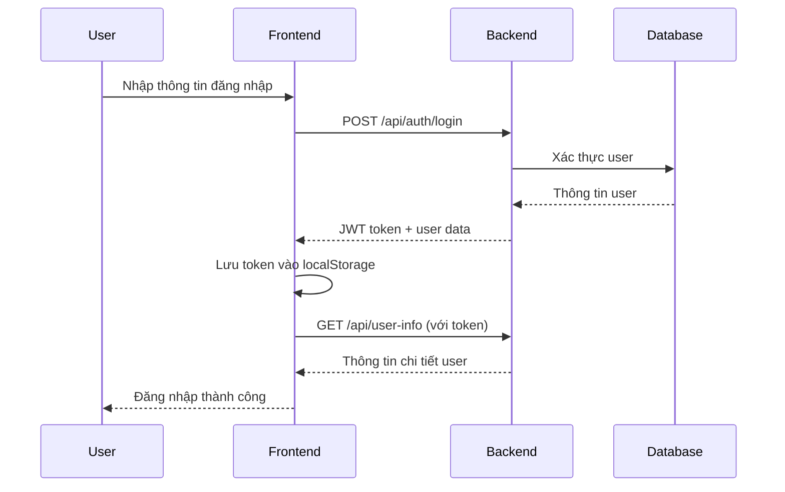

# Tài liệu Kỹ thuật - Ứng dụng Web Lý luận Marx về Hàng hóa

## Tổng quan Dự án

**Tên dự án**: Marx Theory Web Application  
**Phiên bản**: 0.1.0  
**Ngôn ngữ chính**: TypeScript/React  
**Framework UI**: Material-UI (MUI) v5  
**Kiến trúc**: Single Page Application (SPA)

## Kiến trúc Hệ thống

### 1. Kiến trúc Frontend

```
┌─────────────────┐    ┌─────────────────┐    ┌─────────────────┐
│   Presentation  │    │   Business      │    │   Data Access   │
│   Layer         │    │   Logic Layer   │    │   Layer         │
├─────────────────┤    ├─────────────────┤    ├─────────────────┤
│ • Components    │    │ • React Hooks   │    │ • API Services  │
│ • Pages         │◄──►│ • State Mgmt    │◄──►│ • HTTP Client   │
│ • UI Elements   │    │ • Validation    │    │ • Local Storage │
└─────────────────┘    └─────────────────┘    └─────────────────┘
```

### 2. Cấu trúc Thư mục

```
src/
├── components/              # Các component tái sử dụng
│   ├── Auth/               # Components xác thực
│   │   ├── LoginDialog.tsx
│   │   └── RegisterDialog.tsx
│   └── Header/             # Header navigation
│       └── Header.tsx
├── pages/                  # Các trang chính của ứng dụng
│   ├── Home/              # Trang chủ
│   ├── Theory/            # Trang lý thuyết
│   ├── Production/        # Trang sản xuất
│   ├── Profile/           # Trang hồ sơ cá nhân
│   └── Chat/              # Trang chat AI
├── services/              # API services và business logic
│   └── api.ts            # Tích hợp với Spring Boot backend
├── types/                 # TypeScript type definitions
│   └── index.ts
├── App.tsx               # Component chính, routing
└── index.tsx             # Entry point
```

## API Integration

### 1. Cấu hình API Client

```typescript
// Base configuration
const API_BASE_URL = process.env.REACT_APP_API_URL || 'http://localhost:8080';

// Axios instance với interceptors
const apiClient = axios.create({
  baseURL: API_BASE_URL,
  timeout: 10000,
  headers: {
    'Content-Type': 'application/json',
  },
});
```

### 2. Authentication Flow



### 3. API Endpoints

#### Authentication API
- `POST /api/auth/register` - Đăng ký tài khoản mới
- `POST /api/auth/login` - Đăng nhập
- `POST /api/auth/logout` - Đăng xuất

#### User Management API
- `GET /api/user-info` - Lấy thông tin user hiện tại
- `PUT /api/user-info` - Cập nhật thông tin user
- `POST /api/uploadAvatar/{userId}` - Upload avatar

#### Chat API
- `POST /api/chat-messages` - Gửi tin nhắn và nhận phản hồi AI

### 4. Data Models

#### Frontend Types
```typescript
interface User {
  id: string;
  username: string;
  email: string;
  fullName: string;
  avatar?: string;
  bio?: string;
  createdAt: string;
  role?: string;
}

interface ChatMessage {
  id: string;
  content: string;
  sender: 'user' | 'ai';
  timestamp: string;
}

interface AuthState {
  isAuthenticated: boolean;
  user: User | null;
  token: string | null;
}
```

#### Backend DTOs
```typescript
interface ResponseDto<T> {
  status: number;
  message: string;
  data: T;
}

interface RegisterRequest {
  username: string;
  fullName: string;
  email: string;
  password: string;
  confirmPassword: string;
}

interface ChatMessageRequestDto {
  senderId: number;
  message: string;
}
```

## State Management

### 1. Authentication State
- Quản lý bằng React useState trong App.tsx
- Lưu trữ: token, user info, authentication status
- Persistence: localStorage cho token và user data

### 2. Component State
- Local state cho UI interactions
- Form state cho input validation
- Loading states cho API calls

### 3. Data Flow

```
User Action → Component Handler → API Call → State Update → UI Re-render
```

## Security Implementation

### 1. JWT Token Management
- Token được lưu trong localStorage
- Tự động thêm vào Authorization header
- Auto-logout khi token hết hạn (401 response)

### 2. Request Interceptors
```typescript
apiClient.interceptors.request.use((config) => {
  const token = localStorage.getItem('auth_token');
  if (token) {
    config.headers.Authorization = `Bearer ${token}`;
  }
  return config;
});
```

### 3. Response Interceptors
```typescript
apiClient.interceptors.response.use(
  (response) => response,
  (error) => {
    if (error.response?.status === 401) {
      localStorage.removeItem('auth_token');
      window.location.href = '/';
    }
    return Promise.reject(error);
  }
);
```

## UI/UX Design System

### 1. Theme Configuration
```typescript
const theme = createTheme({
  palette: {
    primary: {
      main: '#d32f2f', // Màu đỏ chủ đạo
      light: '#ff6659',
      dark: '#9a0007',
    },
    secondary: {
      main: '#1976d2', // Màu xanh phụ
    },
  },
});
```

### 2. Component Styling
- Material-UI components với custom theme
- Responsive design với Grid system
- Consistent spacing và typography
- Hover effects và transitions

### 3. Navigation
- Tab-based navigation trong Header
- React Router cho client-side routing
- Protected routes cho authenticated users

## Performance Optimization

### 1. Code Splitting
- Lazy loading cho các pages (có thể implement)
- Dynamic imports cho large components

### 2. API Optimization
- Request/Response interceptors
- Error handling và retry logic
- Loading states để improve UX

### 3. Bundle Optimization
- Create React App với built-in optimizations
- Tree shaking cho unused code
- Minification và compression

## Error Handling

### 1. API Error Handling
```typescript
try {
  const response = await apiClient.post('/api/endpoint', data);
  return response.data;
} catch (error: any) {
  if (error.response?.data?.message) {
    throw new Error(error.response.data.message);
  }
  throw new Error('Lỗi mặc định');
}
```

### 2. UI Error Display
- Error messages trong forms
- Toast notifications (có thể implement)
- Fallback UI cho error states

### 3. Validation
- Client-side validation cho forms
- Server-side validation feedback
- Real-time validation feedback

## Testing Strategy

### 1. Unit Testing
- Jest cho logic functions
- React Testing Library cho components
- Mock API calls

### 2. Integration Testing
- End-to-end user flows
- API integration tests
- Authentication flow testing

### 3. Manual Testing
- Cross-browser compatibility
- Responsive design testing
- Accessibility testing

## Deployment

### 1. Build Process
```bash
npm run build
```
- Tạo optimized production build
- Static files trong build/ folder

### 2. Environment Configuration
```bash
REACT_APP_API_URL=http://localhost:8080  # Development
REACT_APP_API_URL=https://api.domain.com # Production
```

### 3. Hosting Options
- Static hosting (Netlify, Vercel)
- CDN deployment
- Docker containerization

## Monitoring và Logging

### 1. Error Tracking
- Console.error cho development
- Error boundary components
- API error logging

### 2. Performance Monitoring
- React DevTools
- Network tab monitoring
- Bundle analyzer

### 3. User Analytics
- User interaction tracking (có thể implement)
- Page view analytics
- Feature usage metrics

## Future Enhancements

### 1. Technical Improvements
- [ ] Implement Redux/Zustand cho complex state
- [ ] Add service worker cho PWA
- [ ] Implement code splitting
- [ ] Add comprehensive testing suite

### 2. Feature Additions
- [ ] Real-time notifications
- [ ] Offline support
- [ ] Multi-language support
- [ ] Dark mode theme

### 3. Performance Optimizations
- [ ] Image lazy loading
- [ ] Virtual scrolling cho large lists
- [ ] Caching strategies
- [ ] Bundle size optimization

## Troubleshooting

### 1. Common Issues
- **CORS errors**: Cấu hình backend cho phép frontend domain
- **Token expiry**: Implement refresh token mechanism
- **Build errors**: Kiểm tra TypeScript types và imports

### 2. Debug Tools
- React Developer Tools
- Network tab trong browser
- Console logs với structured logging

### 3. Performance Issues
- Bundle analyzer để identify large dependencies
- React Profiler để optimize re-renders
- Network throttling để test slow connections
